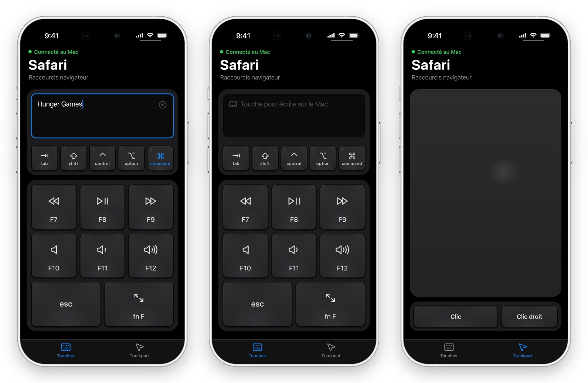
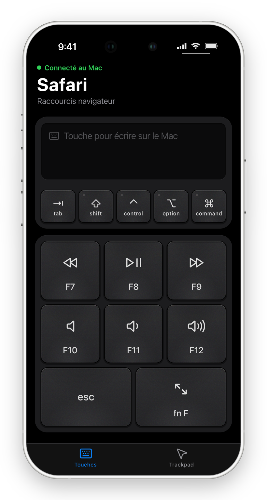
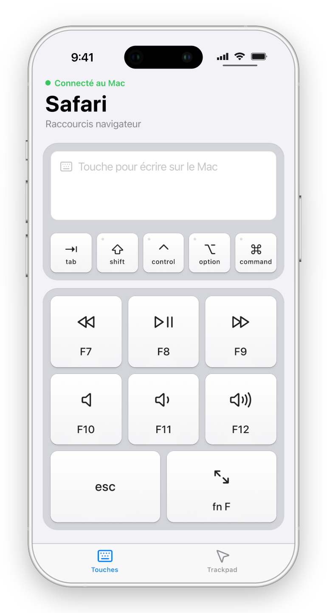
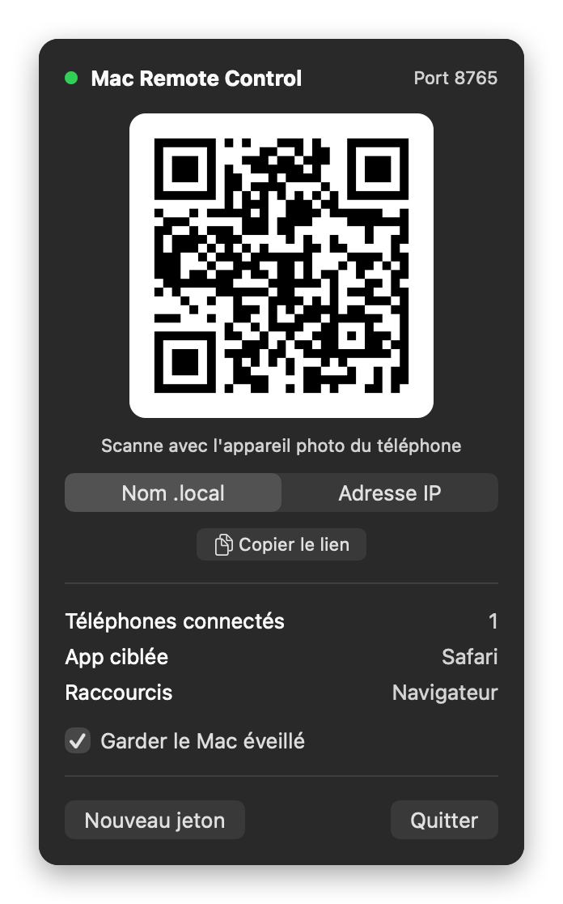

# Mac Remote Control

**Votre iPhone devient la télécommande de votre Mac.** 
Lecture, son, plein écran, souris et clavier, depuis le canapé.

[**Télécharger pour macOS**](../../releases/latest) · macOS 14 Sonoma ou plus récent · Apple Silicon et Intel

 

## Pourquoi Mac Remote Control ?

Je regarde mes films sur mon Mac, et je suis souvent loin de lui : installé dans le canapé, le Mac
branché à la télé ou posé à l'autre bout de la pièce. Pour mettre en pause, monter le son ou passer en
plein écran, il fallait à chaque fois me lever et aller jusqu'au clavier.

Alors j'ai fait Mac Remote Control : j'ouvre l'app sur mon iPhone et je contrôle le Mac sans bouger. Les
touches du clavier Mac sont sur le téléphone, avec un trackpad pour la souris et le clavier de l'iPhone
pour chercher un film ou taper un raccourci.

Ça sert aussi pour une présentation, la musique pendant une soirée, ou un Mac mini branché à la télé.

## Fonctionnalités

- **Les touches du Mac** : ⏪ F7, ⏯ F8, ⏩ F9, 🔇 F10, 🔉 F11, 🔊 F12, esc et plein écran. Avancer, reculer
  et plein écran s'adaptent à l'app au premier plan : YouTube et Netflix dans le navigateur, VLC,
  QuickTime, IINA…
- **Trackpad** : un doigt pour déplacer le curseur, un toucher pour cliquer, deux doigts pour défiler
  ou faire un clic droit.
- **Clavier** : touchez la zone de saisie et tapez sur le clavier de l'iPhone, le texte arrive sur le
  Mac. Avec ⇧ shift, ⌃ control, ⌥ option, ⌘ command et tab pour tous les raccourcis (⌘Q, ⌘Tab…).
- **Rien à installer sur le téléphone** : la télécommande est une page web, à ajouter à l'écran
  d'accueil pour l'ouvrir comme une app. Fonctionne sur iPhone et sur Android.
- **Privé** : tout reste sur votre réseau Wi-Fi. Pas de compte, pas de cloud, pas de suivi.
- **Retour haptique** à chaque appui, pour sentir la touche sans regarder l'écran (iPhone avec iOS 18
  ou plus récent, Android).
- **Clair et sombre**, au style d'iOS, selon le réglage du téléphone.

## Installation

1. **Téléchargez** `MacRemoteControl-x.y.z.dmg` depuis la [dernière version](../../releases/latest).
2. **Ouvrez le fichier** et glissez **Mac Remote Control** dans le dossier **Applications**.
3. **Lancez Mac Remote Control** depuis Applications ou Spotlight. Il n'y a ni fenêtre ni icône dans le Dock :
   l'app vit dans la barre des menus, sous l'icône ⏯.
4. **Autorisez l'accessibilité** : cliquez sur ⏯ › *Ouvrir les réglages*, puis activez **Mac Remote Control**
   dans *Réglages Système › Confidentialité et sécurité › Accessibilité*. C'est ce qui permet à l'app
   de simuler le clavier et la souris.
5. Si macOS demande si Mac Remote Control peut **accepter des connexions entrantes**, cliquez sur *Autoriser*.

### Connecter le téléphone

1. Le téléphone et le Mac doivent être sur **le même réseau Wi-Fi**.
2. Cliquez sur ⏯ dans la barre des menus : un QR code s'affiche.
3. Scannez-le avec l'**appareil photo** du téléphone et ouvrez le lien.
4. Sur iPhone, touchez **Partager › Sur l'écran d'accueil**. La télécommande s'ouvre ensuite en plein
   écran, comme une app.

Le téléphone ne trouve pas le Mac ? Dans le menu, passez de *Nom .local* à *Adresse IP* et scannez à
nouveau le QR code (c'est fréquent sur Android).

Pour lancer Mac Remote Control à chaque démarrage : *Réglages Système › Général › Ouverture*, puis ajoutez
Mac Remote Control.

 

## Utilisation

### Touches

| Touche | Action          | Détail                                                         |
|--------|-----------------|----------------------------------------------------------------|
| F7     | Reculer         | Selon l'app au premier plan (voir ci-dessous)                  |
| F8     | Lecture / pause | Touche média du Mac, marche avec toutes les apps               |
| F9     | Avancer         | Selon l'app au premier plan                                    |
| F10    | Couper le son   | Touche média                                                   |
| F11    | Baisser le son  | Touche média, avec l'indicateur de volume de macOS             |
| F12    | Monter le son   | Touche média                                                   |
| esc    | Échap           | Quitter le plein écran, fermer un menu…                        |
| fn F   | Plein écran     | Selon l'app au premier plan                                    |

Gardez le doigt sur F7, F9, F11 ou F12 pour répéter.

| App au premier plan                                     | Reculer / avancer | Plein écran |
|---------------------------------------------------------|-------------------|-------------|
| Navigateurs (Safari, Chrome, Arc, Dia, Firefox, Brave…) | ← / →             | F           |
| VLC                                                     | ⌘← / ⌘→           | ⌘F          |
| Autres apps (IINA, QuickTime…)                          | ← / →             | ⌃⌘F         |

### Clavier et raccourcis

- **Écrire** : touchez la zone de saisie, le clavier de l'iPhone s'ouvre. Le texte part sur le Mac au
  fur et à mesure, accents, emoji, ⌫ et retour compris. La zone affiche ce que vous avez tapé ; ⓧ vide
  cet aperçu sans rien effacer sur le Mac.
- **Modificateurs** (⇧ ⌃ ⌥ ⌘), comme la touche majuscule de l'iPhone :
  - **un appui** : le modificateur s'applique à la touche suivante. ⌘ puis « q » sur le clavier de
    l'iPhone envoie ⌘Q ;
  - **deux appuis** : il est verrouillé (voyant vert) et reste enfoncé sur le Mac jusqu'au prochain
    appui. ⌘ verrouillé puis tab, tab, tab fait défiler les apps comme sur un vrai clavier.
- Les raccourcis envoyés s'affichent un instant dans une bulle.
- Les lettres passent par la disposition de clavier du Mac (AZERTY, QWERTY…) : ⌘ + « q » déclenche
  bien ⌘Q quelle que soit la disposition.

### Trackpad

| Geste                           | Effet                                        |
|---------------------------------|----------------------------------------------|
| Glisser un doigt                | Déplacer le curseur (plus vite si vous glissez vite) |
| Toucher                         | Clic (deux touchers rapides : double-clic)   |
| Glisser deux doigts             | Défiler, le contenu suit les doigts          |
| Toucher avec deux doigts        | Clic droit                                   |
| Garder **Clic** + glisser       | Glisser-déposer, sélectionner du texte       |

## Regarder un film capot fermé

Un Mac portable capot fermé ne reste allumé que s'il est branché **au secteur et à un écran externe**
(télé, moniteur). L'option *Garder le Mac éveillé* du menu, activée par défaut, empêche la mise en
veille automatique pendant une pause, mais pas celle du capot.

## Dépannage

**Le téléphone affiche « Mac injoignable »**
- Vérifiez que le téléphone et le Mac sont sur le même Wi-Fi, et que Mac Remote Control est lancé (icône ⏯).
- Dans le menu, passez sur *Adresse IP* et scannez à nouveau le QR code.
- Certains Wi-Fi (hôtel, réseau invité) empêchent les appareils de communiquer entre eux. Utilisez le
  partage de connexion du téléphone à la place.
- Si le pare-feu de macOS est activé : *Réglages Système › Réseau › Pare-feu › Options*, autorisez
  Mac Remote Control.

**Les touches ne font rien sur le Mac**
- Vérifiez l'autorisation *Accessibilité*. Après une mise à jour de Mac Remote Control, désactivez puis
  réactivez l'app dans cette liste.

**Avancer ou reculer ne marche pas dans mon lecteur vidéo**
- Le raccourci dépend de l'app. [Ouvrez une issue](../../issues) avec le nom du lecteur.

**« Lien expiré » sur le téléphone**
- Le jeton de jumelage a été renouvelé (bouton *Nouveau jeton*). Scannez à nouveau le QR code.

## Confidentialité et sécurité

- Mac Remote Control fonctionne **uniquement sur votre réseau local** : l'app du Mac envoie la page au
  téléphone et reçoit ses commandes directement. Aucun serveur externe, aucun compte, aucune donnée
  collectée.
- Le jumelage se fait par QR code : le lien contient un jeton secret, sans lequel personne ne peut
  piloter le Mac. *Nouveau jeton* dans le menu déconnecte tous les téléphones.
- ⚠️ La connexion n'est pas chiffrée (HTTP sur le réseau local). Utilisez Mac Remote Control sur un réseau de
  confiance, chez vous par exemple, et évitez d'y taper des mots de passe.

## Contribuer

Bugs, idées et contributions sont les bienvenus. Pour compiler l'app, comprendre son architecture ou
publier une version, voir [CONTRIBUTING.md](CONTRIBUTING.md).

## Licence

Mac Remote Control est un logiciel à code source disponible, sous [PolyForm Strict 1.0.0](LICENSE.md) avec des
autorisations supplémentaires :

- ✅ télécharger et utiliser l'app, lire le code, le modifier pour vous-même, proposer des contributions ;
- ❌ vendre l'app ou une version modifiée, en faire un usage commercial, la redistribuer ou la publier
  sur une boutique d'applications, même gratuitement.

Les versions officielles se téléchargent uniquement depuis la page [Releases](../../releases).
